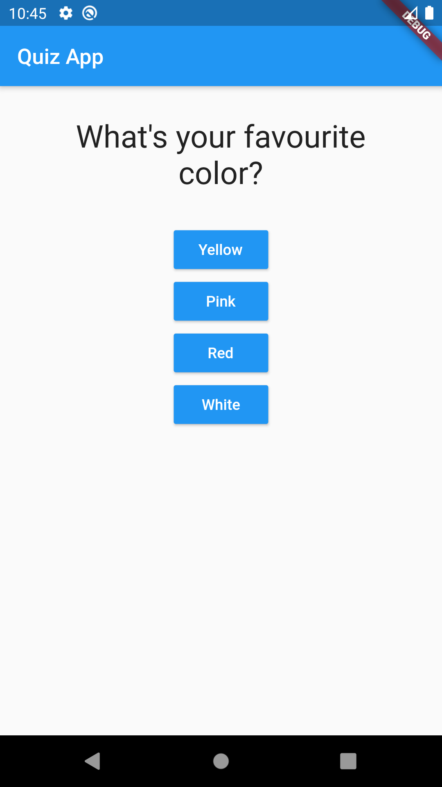
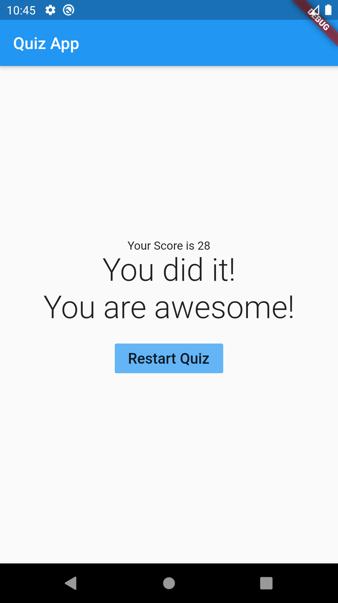

# Personal Quiz App

Interactive Flutter Personality Predictor Quiz App

## Screenshots
   

## Features 
```
1. Personalised Quiz 
2. Result Page
```
### code Features
```
1. Splitting the app into custom widgets
2. Implementation of Map, List, Named Constructors, Parameterised arguments
3. spread operator
```

## Contributing
Pull requests are welcome. For major changes, please open an issue first to discuss what you would like to change.

Please make sure to update tests as appropriate.

